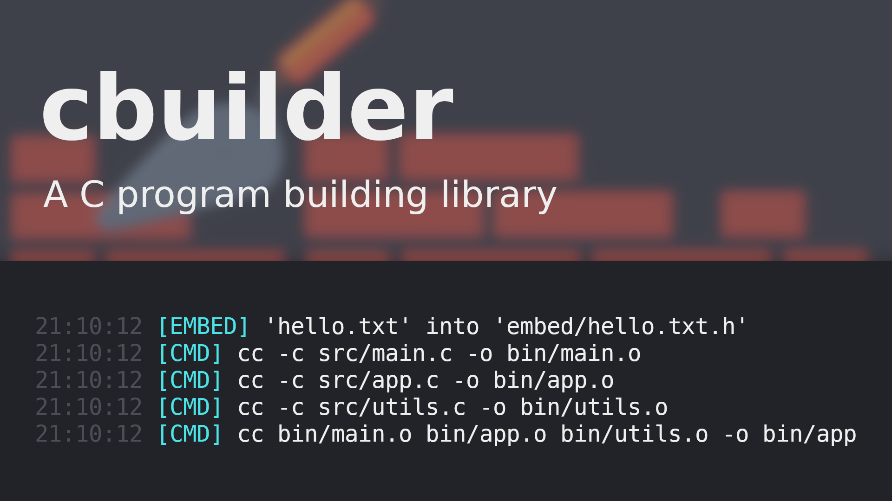

<h1 align="center">cbuilder</h1>
<p align="center">
	<a href="./LICENSE">
		
	</a>
	<a href="https://github.com/LordOfTrident/cbuilder/issues">
		
	</a>
	<a href="https://github.com/LordOfTrident/cbuilder/pulls">
		
	</a>
	
	<br><br><br>
</p>

A C program building [STB-style](https://github.com/nothings/stb) library to replace makefile
and other build systems, heavily inspired by [nobuild](https://github.com/tsoding/nobuild).

## Table of contents
* [Features](#features)
* [Simple example](#simple-example)
* [Documentation](#documentation)
* [Using cbuilder](#using-cbuilder)
* [Quickstart](#quickstart)
* [Bugs](#bugs)

## Features
- [X] Command line arguments system
- [X] Platform detection macros
- [X] CMD macro to run a command
- [X] COMPILE macro to pass given files into a command
- [X] System for embedding files into C source code
- [X] A system detecting which files were modified since last build
- [ ] Rebuild when a header gets modified
- [ ] Rebuilding itself
- [ ] Including files over http

## Simple example
```c
#define CBUILDER_IMPLEMENTATION
#include "cbuilder.h"

char *cc = CC;

int main(int argc, const char **argv) {
	args_t a = build_init(argc, argv);

	flag_cstr(NULL, "CC", "The C compiler path", &cc);
	build_parse_args(&a, NULL);

	CMD(cc, "main.c", "-o", "main");

	return 0;
}
```

## Documentation
Coming soon

## Using cbuilder
Example project using cbuilder is [tokiscript](https://github.com/LordOfTrident/tokiscript)

## Quickstart
Submodule this repository, or copy the entire folder into your project. Create a `build.c` file,
which is the main build source file, include [`cbuilder.h`](./cbuilder.h) in it and write the
build program. Run
```sh
$ cc build.c -o build
```
to bootstrap the build program and
```sh
$ ./build
```
to use it. [See the example](./examples/build.c) to see how to use the library.

## Bugs
If you find any bugs, please create an issue and report them.
